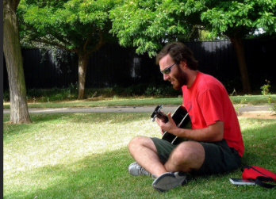

# Image Captioning with Visual Attention + Grad-CAM

A from-scratch PyTorch implementation of a visual-attention image-captioning
model (*Show, Attend and Tell*, Xu et al. 2015) on Flickr8k, with Grad-CAM
visual explanations (Selvaraju et al. 2017) and an interactive Gradio demo.

**🚀 Live demo:** [huggingface.co/spaces/abdallah-03/image-captioning-attention-flickr8k](https://huggingface.co/spaces/abdallah-03/image-captioning-attention-flickr8k)


The interface shows three things for any uploaded image:
1. A generated caption (beam search).
2. A **per-word attention** gallery — for each generated word, the 7×7 image
   regions the decoder attended to.
3. A **sentence-level Grad-CAM** heatmap — which input pixels most influenced
   the full caption.

---

## Results

Evaluated on the Flickr8k test split (809 images, beam size 5):

| Metric  | This work | Show, Attend & Tell (soft, Flickr8k) |
| ------- | :-------: | :----------------------------------: |
| BLEU-1  | **0.6357** | 0.670 |
| BLEU-2  | **0.4666** | 0.448 |
| BLEU-3  | **0.3350** | 0.299 |
| BLEU-4  | **0.2363** | 0.195 |

BLEU-2/3/4 match or exceed the original paper's reported scores on Flickr8k.

---

## Architecture: Show, Attend and Tell

The model has three components:

1. **EncoderCNN — frozen ResNet-50.** We strip the final pooling and
   classification layers, leaving a (7 × 7 × 2048) spatial feature map. We
   reshape this to **49 region vectors of size 2048**. The CNN is frozen
   because Flickr8k's 6 K training images would overfit a fine-tuned ResNet.

2. **Bahdanau (additive) attention.** At each decoding step, the attention
   module takes the previous LSTM hidden state and scores each of the 49
   regions, producing a softmax distribution α over them. The context vector
   is the α-weighted sum of region features. This is the same additive
   attention introduced for machine translation (Bahdanau et al. 2015), here
   applied over image regions instead of source-sentence tokens.

3. **DecoderWithAttention — single-layer LSTM.** Inputs at each step are the
   embedded previous word concatenated with the attention context. Output is a
   distribution over the vocabulary (~9 K words). At inference time we use
   **beam search** (default beam = 5).

**Training objective:** standard cross-entropy on the next word, plus the
**doubly-stochastic attention regularizer** from Show-Attend-Tell:
`λ · Σᵢ (1 − Σₜ αₜᵢ)²`. This encourages every image region to receive some
attention across the full sentence — a useful inductive bias against the
decoder fixating on a single salient region.

See [src/model.py](src/model.py), [src/train.py](src/train.py),
[src/inference.py](src/inference.py).

---

## Grad-CAM: explaining the caption



**What Grad-CAM does** (Selvaraju et al. 2017): given a trained CNN and a
target output (e.g. a class score), it produces a smooth heatmap over the
input image showing which pixels most influenced that output. It works by
combining gradients of the target with respect to a conv layer's activations
(*how much each channel matters*) with the activations themselves
(*where each channel fires*).

**The 6 steps:**
1. Pick a target conv layer — we use the encoder's last block (output 7×7×2048).
2. Forward pass the image; capture activations **A** at the target layer.
3. Pick a target scalar **y** to explain.
4. Backward pass; capture gradients **∂y/∂A**.
5. Per-channel weight = global-average-pool the gradients over the 7×7 grid.
6. Heatmap = `ReLU(Σ_c weight_c · A_c)`, then upsample 7×7 → 224×224 (bilinear).

**Adapting Grad-CAM to captioning.** The original paper applies Grad-CAM to
classifiers, where the target is a single class logit. For a captioning
model the target isn't a single number — it's a *sentence*. We support two
modes (see [src/gradcam.py](src/gradcam.py)):

- **Sentence-level (default)**: target = sum of the chosen-word logits across
  every decoding step. This produces a single heatmap explaining the full
  caption.
- **Word-level**: target = chosen-word logit at a specific step. One heatmap
  per word, useful for fine-grained inspection.

**Two implementation details that mattered:**
- The encoder is normally frozen (`requires_grad=False`). Grad-CAM needs
  gradients to flow through it, so we **temporarily re-enable** them around
  the Grad-CAM call and disable them afterwards.
- We register a forward hook to keep activations *in the graph* (not detached)
  and a full-backward hook to capture gradients on the same layer.

**Attention vs Grad-CAM — why both?** The attention map shows where the
*decoder asked the encoder to look* at each step. Grad-CAM shows which input
pixels the *gradient* says actually influenced the output. They often agree;
when they disagree, that disagreement is informative.

---

## Quickstart

```bash
git clone https://github.com/abdallah035/image-captioning-attention.git
cd image-captioning-attention
python -m venv venv
# Windows:        venv\Scripts\activate
# macOS / Linux:  source venv/bin/activate
pip install -r requirements.txt
python app/gradio_app.py
```

The trained checkpoint (`best.pth`) and vocabulary (`vocab.pth`) are
**auto-downloaded from Hugging Face Hub on first launch**
([abdallah-03/image-captioning-attention-flickr8k](https://huggingface.co/abdallah-03/image-captioning-attention-flickr8k)),
so no manual setup is needed. See [src/checkpoint.py](src/checkpoint.py).

Open the Gradio URL printed in the terminal (default `http://127.0.0.1:7860`),
upload an image, and click **Generate caption**.

---

## Project layout

```
src/
  model.py        EncoderCNN, BahdanauAttention, DecoderWithAttention
  dataset.py      Flickr8k dataset and image transforms
  vocab.py        Word ↔ id vocabulary built from training captions
  train.py        Training loop with teacher forcing
  inference.py    Beam-search decoder
  evaluate.py     BLEU-1/2/3/4 on the test split
  gradcam.py      Grad-CAM hooks on the encoder
  checkpoint.py   Auto-download trained weights from HF Hub
app/
  gradio_app.py   Gradio web demo (caption + attention + Grad-CAM)
  streamlit_app.py  Alternative Streamlit demo
app.py            HF Spaces entry point (imports app/gradio_app.py)
assets/
  screenshots/    README images
```

## Training from scratch

```bash
# 1. Place Flickr8k images under data/Images/
#    and the captions file at data/captions.txt
python -m src.vocab          # build vocabulary
python -m src.train          # train (best checkpoint -> checkpoints/best.pth)
python -m src.evaluate       # BLEU on the test split
```

Training time: ~2 hours on a single GTX 1650 (4 GB), 30 epochs, batch size 32.

## References

1. **Bahdanau, Cho, Bengio.** *Neural Machine Translation by Jointly Learning
   to Align and Translate.* ICLR 2015.
   [[arXiv]](https://arxiv.org/abs/1409.0473)
2. **Xu, Ba, Kiros, Cho, Courville, Salakhutdinov, Zemel, Bengio.**
   *Show, Attend and Tell: Neural Image Caption Generation with Visual
   Attention.* ICML 2015.
   [[arXiv]](https://arxiv.org/abs/1502.03044)
3. **Selvaraju, Cogswell, Das, Vedantam, Parikh, Batra.**
   *Grad-CAM: Visual Explanations from Deep Networks via Gradient-Based
   Localization.* ICCV 2017.
   [[arXiv]](https://arxiv.org/abs/1610.02391)

## License

MIT — see [LICENSE](LICENSE).
