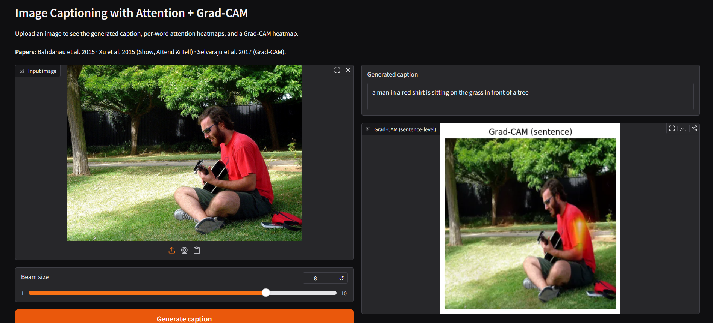

# Image Captioning with Attention + Grad-CAM

End-to-end PyTorch implementation of a visual attention image-captioning model
(*Show, Attend and Tell*, Xu et al. 2015) with Grad-CAM visual explanations
(Selvaraju et al. 2017), trained on Flickr8k. Includes a Gradio web demo.



## Results

Evaluated on the Flickr8k test split (809 images, beam size 5):

| Metric  | Score  | Reference (Show, Attend & Tell, soft-attention, Flickr8k) |
| ------- | ------ | --------------------------------------------------------- |
| BLEU-1  | 0.6357 | 0.670                                                     |
| BLEU-2  | 0.4666 | 0.448                                                     |
| BLEU-3  | 0.3350 | 0.299                                                     |
| BLEU-4  | 0.2363 | 0.195                                                     |

BLEU-2/3/4 match or exceed the original paper's reported scores on Flickr8k.

## What this project does

1. Generates a natural-language caption for any input image.
2. Visualizes **per-word attention** — for each generated word, shows the 7×7 image
   regions the model attended to (Bahdanau-style soft attention).
3. Visualizes **Grad-CAM** — a smooth heatmap of which input pixels most influenced
   the generated caption (sentence-level by default).

## Architecture

- **Encoder:** ResNet-50 pretrained on ImageNet (frozen), final feature map
  reshaped to (49 × 2048) for 7×7 spatial regions.
- **Attention:** additive (Bahdanau) attention over the 49 regions at each decoding step.
- **Decoder:** single-layer LSTM with attention-weighted context vector,
  word embedding 512, hidden 512, vocabulary size ≈ 9k.
- **Training:** cross-entropy + doubly-stochastic attention regularizer
  (encourages each region to receive attention across the sentence).

See [src/model.py](src/model.py) for the full network and
[src/gradcam.py](src/gradcam.py) for the explanation hooks.

## Quickstart

```bash
git clone https://github.com/abdallah035/image-captioning-attention.git
cd image-captioning-attention
python -m venv venv
# Windows:  venv\Scripts\activate
# macOS/Linux:  source venv/bin/activate
pip install -r requirements.txt
python app/gradio_app.py
```

The trained checkpoint and vocabulary are auto-downloaded from
Hugging Face Hub on first launch (see [src/checkpoint.py](src/checkpoint.py)),
so no manual setup is required.

Open the Gradio URL printed in the terminal (default: `http://127.0.0.1:7860`),
upload an image, and click **Generate caption**.

## Project layout

```
src/
  model.py        EncoderCNN, BahdanauAttention, DecoderWithAttention
  dataset.py      Flickr8k dataset + transforms
  vocab.py        Word↔id vocabulary (built from training captions)
  train.py        Training loop with teacher forcing
  inference.py    Beam search decoder
  evaluate.py     BLEU-1/2/3/4 on the test split
  gradcam.py      Grad-CAM hooks on the encoder's last conv block
  checkpoint.py   Auto-download the trained model from HF Hub
app/
  gradio_app.py   Web demo: caption + attention + Grad-CAM
  streamlit_app.py  Alternative Streamlit demo
assets/
  screenshots/    README images
```

## Training from scratch

```bash
# 1. Place Flickr8k images in data/Images/ and captions in data/captions.txt
python -m src.vocab            # build the vocabulary
python -m src.train            # train (saves to checkpoints/best.pth)
python -m src.evaluate         # BLEU on the test split
```

Training time: ~2 hours on a single GTX 1650 (4 GB), 30 epochs, batch size 32.

## References

1. **Bahdanau, Cho, Bengio.** *Neural Machine Translation by Jointly Learning to
   Align and Translate.* ICLR 2015. [[arXiv]](https://arxiv.org/abs/1409.0473)
2. **Xu, Ba, Kiros, Cho, Courville, Salakhutdinov, Zemel, Bengio.**
   *Show, Attend and Tell.* ICML 2015. [[arXiv]](https://arxiv.org/abs/1502.03044)
3. **Selvaraju, Cogswell, Das, Vedantam, Parikh, Batra.**
   *Grad-CAM: Visual Explanations from Deep Networks.* ICCV 2017.
   [[arXiv]](https://arxiv.org/abs/1610.02391)

## License

MIT — see [LICENSE](LICENSE).
